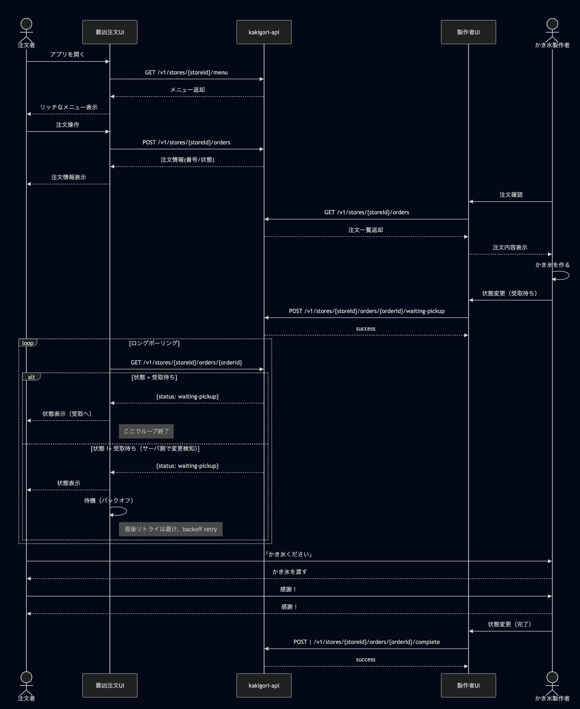

# かき氷注文 API (Kakigori API)

Go 製のかき氷注文管理 API サーバーです。
(acu が少し修正を加えています)

---

## 目次

- [概要](#概要)
- [セットアップ](#セットアップ)
  - [環境変数](#環境変数)
  - [ローカル起動](#ローカル起動)
  - [Docker で起動](#dockerで起動)
- [テスト](#テスト)
- [ファイル構成](#ファイル構成)
- [API 仕様](#api仕様)
  - [エンドポイント一覧](#エンドポイント一覧)
  - [サンプルリクエスト/レスポンス](#サンプルリクエストレスポンス)
- [OpenAPI 仕様 (openapi.yaml)](#openapi仕様-openapiyaml)
  - [OpenAPI 仕様の生成方法](#openapi仕様の生成方法)
  - [OpenAPI 仕様のプレビュー方法](#openapi仕様のプレビュー方法)

---

## 概要

この API は、複数ストアのかき氷メニュー取得・注文・注文ステータス管理を行うシンプルな REST API です。ハッカソン用に簡易的に使えるように権限管理などかなり緩くしたものになります。

簡易的な全体フローは以下の様になります。


---

## セットアップ

### 環境変数

| 変数名                      | デフォルト値 | 説明                                 |
| --------------------------- | ------------ | ------------------------------------ |
| KAKIGORI_STORE_IDS          | (必須)       | 有効なストア ID のカンマ区切りリスト |
| KAKIGORI_MAX_ORDERS         | 100          | 1 ストアあたりの最大注文数           |
| KAKIGORI_PORT               | 8080         | サーバーのポート番号                 |
| KAKIGORI_STORE_MAX_REQUESTS | 10           | 1IP の同時リクエスト上限             |

#### 設定例

本プロジェクト(backend)のルートディレクトリに`.env`ファイルを追加して以下のように設定してください。

```bash
KAKIGORI_STORE_IDS="store-001,store-002"
KAKIGORI_MAX_ORDERS="100"
KAKIGORI_PORT="8080"
KAKIGORI_STORE_MAX_REQUESTS="10"
```

または、下記のように環境変数を シェル環境で export してください。

```bash
export KAKIGORI_STORE_IDS="store-001,store-002"
export KAKIGORI_MAX_ORDERS="100"
export KAKIGORI_PORT="8080"
export KAKIGORI_STORE_MAX_REQUESTS="10"
```

### ローカル起動

```bash
# goをインストールする必要があります。See. https://go.dev/doc/install
go mod download # もしくは go mod tidy
go run cmd/server/main.go
```

### Docker で起動

```bash
docker build -t kakigori-api .
docker run -d -e KAKIGORI_STORE_IDS="store-001,store-002" -p 8080:8080 kakigori-api
```

### Docker Compose で起動(追加)

```bash
docker compose up --build [--no-cache]
```

---

## テスト

```bash
go test ./...
```

---

## ファイル構成

```
.
├── cmd/
│   └── server/
│       └── main.go                # エントリーポイント
├── internal/
│   ├── common/                   # 共通処理
│   ├── config/                   # 設定
│   ├── domain/                   # ドメイン（menu, order, store）
│   ├── handler/
│   │   ├── health/               # ヘルスチェックAPI
│   │   ├── menu/                 # メニューAPI
│   │   ├── order/                # 注文API
│   │   └── response/             # レスポンスユーティリティ
│   ├── middleware/
│   │   ├── cors/                 # CORS
│   │   ├── logging/              # ロギング
│   │   └── ratelimit/            # IPレートリミット
│   ├── repository/               # メモリDB（menu, order, store）
│   └── usecase/                  # ユースケース（menu, order）
├── tests/                        # 統合テスト
├── Dockerfile
├── fly.toml
├── go.mod / go.sum
├── Makefile
├── openapi.yaml                  # OpenAPI仕様
└── README.md
```

---

## API 仕様

### エンドポイント一覧

| メソッド | パス                                                 | 概要                     | 主なレスポンス             | エラー例                                                                                                                                                                                                                       |
| -------- | ---------------------------------------------------- | ------------------------ | -------------------------- | ------------------------------------------------------------------------------------------------------------------------------------------------------------------------------------------------------------------------------ |
| GET      | /v1/stores/{storeId}/menu                            | メニュー取得             | 200: `{ "menu": [...] }`   | 404: `{ "error": "Not Found", "message": "Store not found" }`                                                                                                                                                                  |
| POST     | /v1/stores/{storeId}/orders                          | 注文作成                 | 201: 注文情報              | 400: `{ "error": "Bad Request", "message": "Invalid request body" }`<br>400: `{ "error": "Bad Request", "message": "menu item not found: ..." }`<br>404: `{ "error": "Not Found", "message": "Store not found" }`              |
| GET      | /v1/stores/{storeId}/orders                          | 注文一覧取得             | 200: `{ "orders": [...] }` | 404: `{ "error": "Not Found", "message": "Store not found" }`                                                                                                                                                                  |
| GET      | /v1/stores/{storeId}/orders/{orderId}                | 注文取得                 | 200: 注文情報              | 400: `{ "error": "Bad Request", "message": "Invalid order ID format" }`<br>404: `{ "error": "Not Found", "message": "Order not found" }`                                                                                       |
| POST     | /v1/stores/{storeId}/orders/{orderId}/waiting-pickup | 注文を受付済み状態に更新 | 200: 注文情報              | 400: `{ "error": "Bad Request", "message": "Invalid order ID format" }`<br>400: `{ "error": "Bad Request", "message": "order status is not pending" }`<br>404: `{ "error": "Not Found", "message": "Order not found" }`        |
| POST     | /v1/stores/{storeId}/orders/{orderId}/complete       | 注文を完了状態に更新     | 200: 注文情報              | 400: `{ "error": "Bad Request", "message": "Invalid order ID format" }`<br>400: `{ "error": "Bad Request", "message": "order status is not waiting pickup" }`<br>404: `{ "error": "Not Found", "message": "Order not found" }` |

---

### サンプルリクエスト/レスポンス

#### メニュー取得

```bash
curl https://kakigori-api.fly.dev/v1/stores/{STORE_ID}/menu
```

レスポンス例:

```json
{
  "menu": [
    {
      "id": "giiku-sai",
      "name": "技育祭な いちご味",
      "description": "技育祭をイメージしたいちご味のかき氷"
    },
    {
      "id": "giiku-haku",
      "name": "技育博な メロン味",
      "description": "技育博をイメージしたメロン味のかき氷"
    }
  ]
}
```

#### 注文作成

```bash
curl -X POST \
	https://kakigori-api.fly.dev/v1/stores/{STORE_ID}/orders \
	-H "Content-Type: application/json" \
	-d '{"menu_item_id": "giiku-sai"}'
```

リクエストボディ:

```json
{
  "menu_item_id": "giiku-sai"
}
```

レスポンス例:

```json
{
  "id": "store-001-1",
  "menu_item_id": "giiku-sai",
  "menu_name": "技育祭な いちご味",
  "status": "pending",
  "order_number": 1
}
```

#### 注文一覧取得

```bash
curl https://kakigori-api.fly.dev/v1/stores/{STORE_ID}/orders
```

レスポンス例:

```json
{
  "orders": [
    {
      "id": "store-001-1",
      "menu_item_id": "giiku-sai",
      "menu_name": "技育祭な いちご味",
      "status": "pending",
      "order_number": 1
    }
  ]
}
```

#### 注文取得

```bash
curl https://kakigori-api.fly.dev/v1/stores/{STORE_ID}/orders/{ORDER_ID}
```

レスポンス例:

```json
{
  "id": "store-001-1",
  "menu_item_id": "giiku-sai",
  "menu_name": "技育祭な いちご味",
  "status": "pending",
  "order_number": 1
}
```

#### 注文を受取待ち状態に更新

```bash
curl -X POST https://kakigori-api.fly.dev/v1/stores/{STORE_ID}/orders/{ORDER_ID}/waiting-pickup
```

レスポンス例:

```json
{
  "id": "store-001-1",
  "menu_item_id": "giiku-sai",
  "menu_name": "技育祭な いちご味",
  "status": "waitingPickup",
  "order_number": 1
}
```

#### 注文を完了状態に更新

```bash
curl -X POST https://kakigori-api.fly.dev/v1/stores/{STORE_ID}/orders/{ORDER_ID}/complete
```

レスポンス例:

```json
{
  "id": "store-001-1",
  "menu_item_id": "giiku-sai",
  "menu_name": "技育祭な いちご味",
  "status": "completed",
  "order_number": 1
}
```

---

## OpenAPI 仕様 (`openapi.yaml`)

本 API の OpenAPI 仕様は `openapi.yaml` に記載しています。

### OpenAPI 仕様の生成方法

OpenAPI 仕様（openapi.yaml）は**手動**で記述しています。

### OpenAPI 仕様のプレビュー方法

#### 1. VS Code 拡張機能を使う

- インストール: VS Code の拡張機能から `Swagger Viewer` を検索しインストール
- `openapi.yaml` を開き、右クリック →「Swagger Viewer: Preview Swagger」

#### 2. Swagger Editor (Web) を使う

- https://editor.swagger.io/ を開き、`openapi.yaml` の内容を貼り付け
- その場でプレビュー・編集・検証が可能

#### 3. ローカルで Swagger UI サーバーを立てる

Docker で簡単に Swagger UI を立ち上げて `openapi.yaml` をプレビューできます。

```bash
docker run --rm -p 8081:8080 -v $(pwd)/openapi.yaml:/usr/share/nginx/html/openapi.yaml swaggerapi/swagger-ui
```

- ブラウザで http://localhost:8081 にアクセス
- 画面上部の「Explore」に `/openapi.yaml` と入力して読み込む

---

HAPPY HACKING!!!
